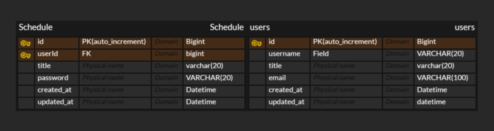

일정API
| **기능** | **Method** | **URL** | **Request** | **Response** | **상태코드** |
| --- | --- | --- | --- | --- | --- |
| 일정생성 | Post | /schedule | 요청 Body   할일 : String   작성자 : String   비밀번호:   String | 할일 : String   작성자: String   일정ID : Long   작성일:LocalDate   수정일:LocalDate | 200: 정상등록 |
| 일정전체조회 | Get | /schedule/{scheduleId} | 요청 Param   수정일 :LocalDate   작성자명:String | 할일 : String   작성자: String   일정ID : Long   작성일:LocalDate   수정일:LocalDate | 200: 정상조회 |
| 일정단일조회 | Get | /schedule | 요청Param   일정 ID: Long | 할일 : String   작성자: String   일정ID : Long   작성일:LocalDate   수정일:LocalDate | 200: 정상조회 |
| 일정수정 | Put | /schedule/{scheduleId} | 요청 Param   요청ID :Long   요청Body   비밀번호: String  작성자명: String| 할일 : String   작성자: String   일정ID : Long   작성일:LocalDate   수정일:LocalDate | 200: 정상수정 |
| 일정삭제 | Delete | /schedule/{scheduleId} | 요청Param   요청ID: Long   요청 Body   비밀번호:String |  | 200: 정상삭제 |
유저 API
| **기능** | **Method** | **URL** | **Request** | **Response** | **상태코드** |
| --- | --- | --- | --- | --- | --- |
| 회원생성 | Post | /members | 요청 Body   할일제목 : String   할일작성자 : String | 상태코드:   int   핵심데이터:   object   할일식별자:   id | 200: 정상등록 |
| 회원전체조회 | Get | /members | 요청 Param   수정일 :LocalDate   회원이름:String | 상태코드:   int   핵심데이터:   object   할일식별자:   id   회원이름:   String   회원나이:   int | 200: 정상조회 |
| 회원단일조회 | Get | /members/{memberId} | 요청Param   회원 ID: Long | 상태코드:   int   핵심데이터:   object   할일식별자:   id   회원이름:   String   회원나이:   int | 200: 정상조회 |
| 회원수정 | Put | /members/{memberId} | 요청 Param   요청ID :Long   요청Body   비밀번호: String | 상태코드:   int   핵심데이터:   object   할일식별자:   id   회원이름:   String   회원나이:   int | 200: 정상수정 |
| 회원삭제 | Delete | /members/{memberId} | 요청Param   요청ID: Long   요청 Body   비밀번호:String |  | 200: 정상삭제 |

ERD
